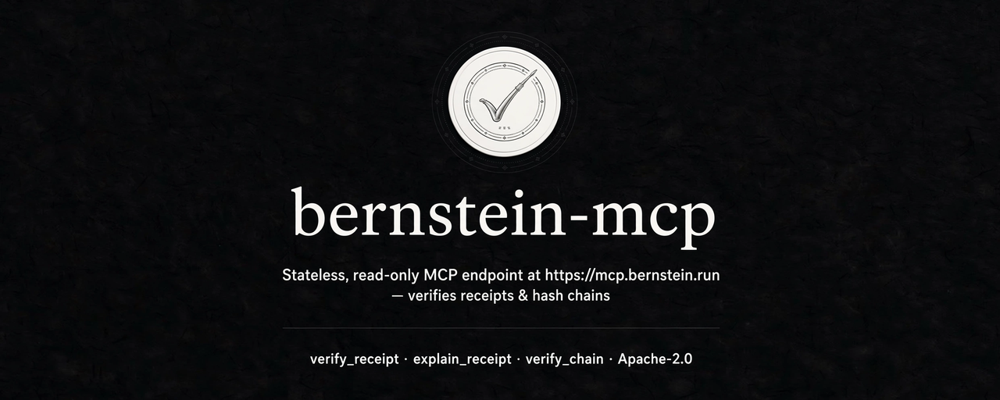

# bernstein-mcp

Stateless, read-only MCP endpoint at **https://mcp.bernstein.run** that verifies
[bernstein](https://github.com/sipyourdrink-ltd/bernstein) run receipts and
hash chains. No account, no key, nothing stored, nothing fetched.

```
claude mcp add --transport http bernstein https://mcp.bernstein.run/mcp
```

## What it does

| Tool | Result |
|---|---|
| `verify_receipt` | recomputes every chain a run receipt embeds, rebuilds the signed subject, checks the Ed25519 signature; verdict + one line per check, plus the verdict as a signed statement (below) |
| `explain_receipt` | the same verification, narrated: what the run recorded, where it diverges, what the result does and does not prove |
| `verify_chain` | walks journal rows, lineage entries or audit events on their own (pass the file text for byte-exact rows); names the first broken link |
| `list_presets` / `get_preset` | the compliance presets this release ships |
| `list_adapters` | the agent adapters bundled with this release |
| `server_info` | version and limits |

Same walk as `bernstein verify-receipt`, reachable from any MCP client or the
paste form at [/verify](https://mcp.bernstein.run/verify). A verdict's page
address is the receipt's own digest.

## Trust model

| Proves | Does not prove |
|---|---|
| the embedded rows are exactly the rows that were signed | that the embedded key belongs to who you think (trust-on-first-use; pin the operator's published key yourself) |
| nothing was edited, reordered, dropped or appended after signing | audit-range HMAC values (keyed by the producing install; their linkage and content hash are still checked) |

Pass the receipt file's contents as a **string**: an already parsed object
cannot tell `1` from `1.0`, and the reference hashes the original spelling.

## Signed verdicts

Every verdict comes back as a [DSSE](https://github.com/secure-systems-lab/dsse)
envelope (`signed_verdict`) signed with this deployment's Ed25519 key: the
payload is a JCS-canonical statement naming the receipt by digest, the
verdict, every check, and an `appraisal` block in the EAR status vocabulary
(`affirming` / `contraindicated` / `none`). Keep it next to the receipt;
anyone can re-check it offline against the public key at
[/.well-known/bernstein-mcp/keys.json](https://mcp.bernstein.run/.well-known/bernstein-mcp/keys.json)
(`kid` = RFC 7638 thumbprint). The signature covers the DSSE PAE of
`application/vnd.bernstein.verdict+json`, the same construction the receipt
itself uses. It attests that *this verifier reached this verdict for these
bytes at this time* — nothing about the receipt's producer.

## Session receipts

`bernstein-attest` turns a Claude Code or Codex CLI session into a signed run receipt that this server verifies.

```bash
npx bernstein-attest init          # registers hooks for both agents (user scope); --claude-code / --codex / --project to narrow
bernstein-attest link              # verify link + one Markdown line for a PR description
bernstein-attest verify .bernstein/receipts/<session>.json
```

Codex runs project hooks only after they are trusted once with `/hooks` in an interactive session; `codex exec` skips untrusted hooks without printing anything.

Recorded per tool call: tool name, hashes of its input and output, success flag, repo-relative path for files the call wrote (hash only for paths outside the project), the program name of a shell command (first token, path stripped, at most 32 characters). Not recorded: prompts, model output, command text, file contents, absolute paths. The receipt is sealed at the end of every turn that recorded something new, and every 2 000 rows; the file lives in `.bernstein/receipts/` and can be committed with the change it describes. Because later turns reseal the same file, run `npx bernstein-attest link` right before committing it so the link you paste names the current bytes.

## Limits

| | |
|---|---|
| Request body | 1 MiB |
| Rows per chain | 2 000 (larger receipts: verify locally) |
| Rate | 60 requests/min per address on `POST /mcp` and `POST /verify` |
| Logging | one JSON line per request: route, method, status, JSON-RPC method, tool, verdict, producer family, MCP client name/version, country, colo. Never the address, a header, the body or the receipt |

## Correctness

`vectors/` holds eight golden vectors generated by the Python reference
(`scripts/gen_vectors.py` against the pinned bernstein source). The
TypeScript verifier must reproduce each vector's verdict, every check, the
binding bytes and the receipt digest byte for byte (`test/vectors.test.ts`).
`vectors/session/` holds three frozen session receipts written by
`bernstein-attest` (`scripts/gen-session-vectors.mjs`).

## Development

```bash
npm install
npm test          # no-fetch guard + vitest
npm run typecheck
npm run dev       # wrangler dev
```

`src/` may not call `fetch`, `eval` or `new Function`; CI fails otherwise.
Deploying: see [DEPLOY.md](DEPLOY.md). Licence: Apache-2.0.
